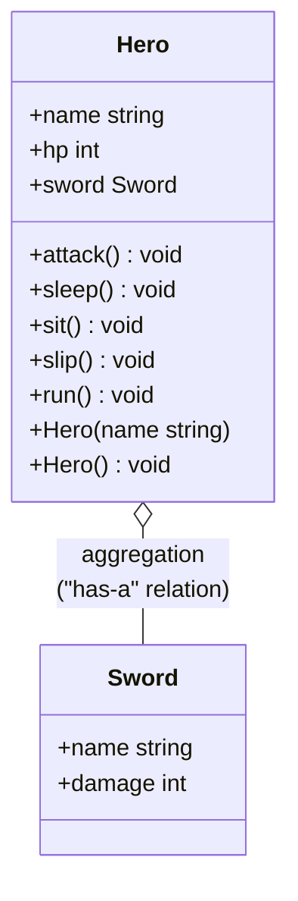

```mermaid
classDiagram

class Hero{
    +name string
    +hp int
    +sword Sword
    +attack() void
    +sleep() void
    +sit() void
    +slip() void
    +run() void
    +Hero(name string)
    +Hero() void
}

class Sword{
    +name string
    +damage int
}

Hero o-- Sword : aggregation</br>("has-a" relation)
```
