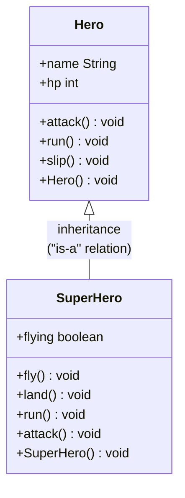

```mermaid
classDiagram

class Hero{
    +name String
    +hp int
    +attack() void
    +run() void
    +slip() void
    +Hero() void
}

class SuperHero{
    +flying boolean
    +fly() void
    +land() void
    +run() void
    +attack() void
    +SuperHero() void
}

Hero <|-- SuperHero : inheritance</br>("is-a" relation)

```
