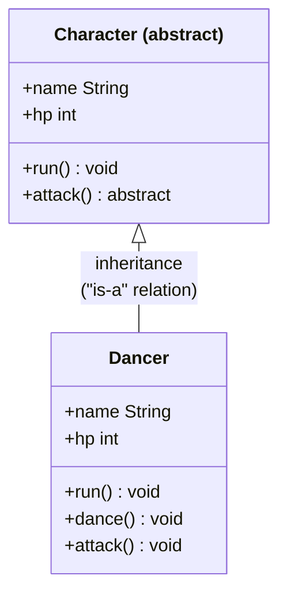

```mermaid
classDiagram

class Character["Character (abstract)"]{
    +name String
    +hp int
    +run() void
    +attack() abstract
}

class Dancer{
    +name String
    +hp int
    +run() void
    +dance() void
    +attack() void
}

Character <|-- Dancer : inheritance</br>("is-a" relation)

```
