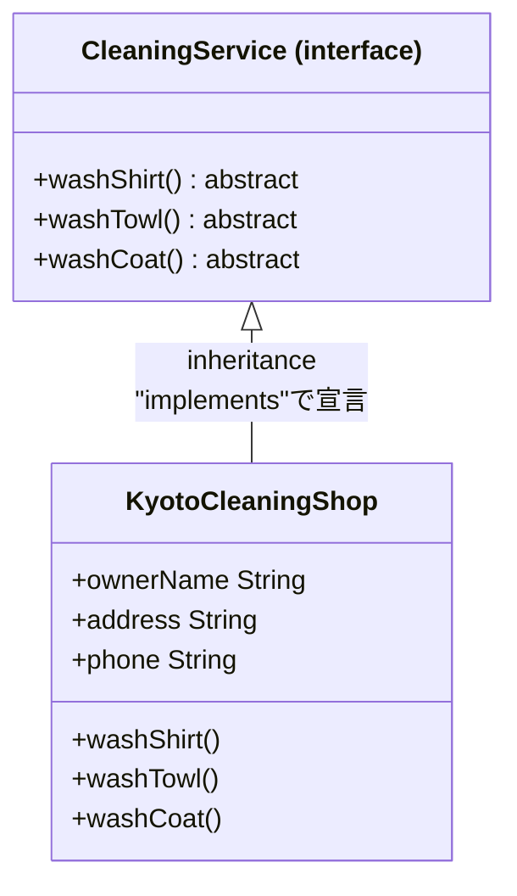
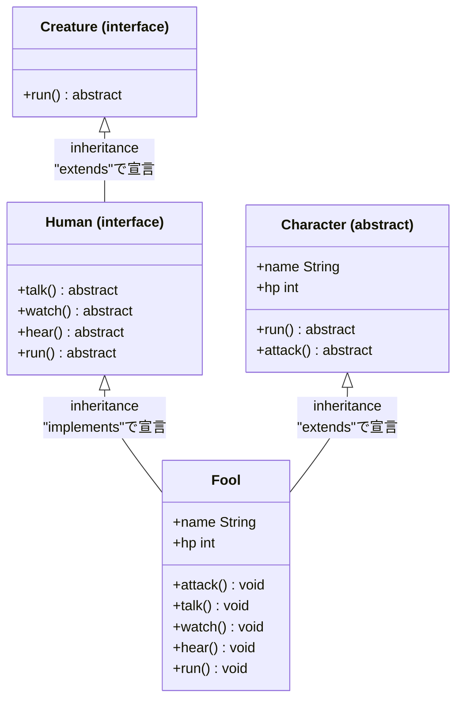

```mermaid
classDiagram

class CleaningService["CleaningService (interface)"]{
    +washShirt() abstract
    +washTowl() abstract
    +washCoat() abstract
}

class KyotoCleaningShop["KyotoCleaningShop"]{
    +ownerName String
    +address String
    +phone String
    +washShirt()
    +washTowl()
    +washCoat()
}

CleaningService <|-- KyotoCleaningShop : inheritance</br>"implements"で宣言
```

---

```mermaid
classDiagram

class Creature["Creature (interface)"]{
    +run() abstract
}

class Human["Human (interface)"]{
    +talk() abstract
    +watch() abstract
    +hear() abstract
    +run() abstract
}

class Character["Character (abstract)"] {
    +name String
    +hp int
    +run() abstract
    +attack() abstract
}

class Fool["Fool"]{
    +name String
    +hp int
    +attack() void
    +talk() void
    +watch() void
    +hear() void
    +run() void
}

Creature <|-- Human : inheritance</br>"extends"で宣言
Human <|-- Fool : inheritance</br>"implements"で宣言
Character <|-- Fool : inheritance</br>"extends"で宣言
```
