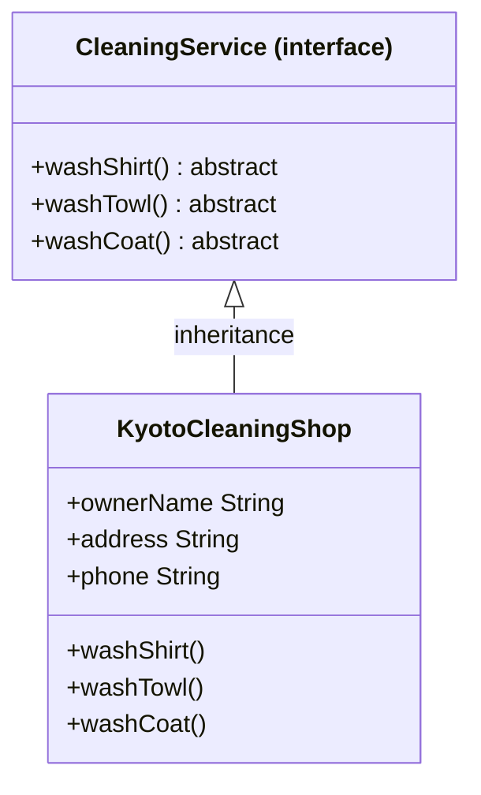

```mermaid
classDiagram

class CleaningService["CleaningService (interface)"]{
    +washShirt() abstract
    +washTowl() abstract
    +washCoat() abstract
}

class KyotoCleaningShop["KyotoCleaningShop"]{
    +ownerName String
    +address String
    +phone String
    +washShirt()
    +washTowl()
    +washCoat()
}

CleaningService <|-- KyotoCleaningShop : inheritance
```
