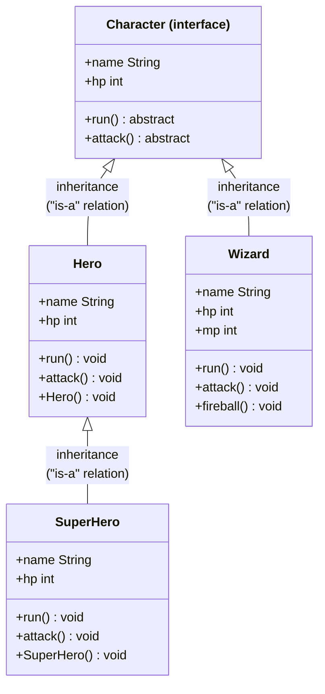
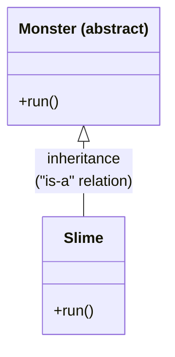

```mermaid
classDiagram

class Character["Character (interface)"]{
    +name String
    +hp int
    +run() abstract
    +attack() abstract
}

class Hero{
    +name String
    +hp int
    +run() void
    +attack() void
    +Hero() void
}

class SuperHero{
    +name String
    +hp int
    +run() void
    +attack() void
    +SuperHero() void
}

class Wizard{
    +name String
    +hp int
    +mp int
    +run() void
    +attack() void
    +fireball() void
}

Character <|-- Hero : inheritance</br>("is-a" relation)
Hero <|-- SuperHero : inheritance</br>("is-a" relation)
Character <|-- Wizard : inheritance</br>("is-a" relation)
```
---

```mermaid
classDiagram

class Monster["Monster (abstract)"]{
    +run()
}

class Slime{
    +run()
}

Monster <|-- Slime : inheritance</br>("is-a" relation)

```
