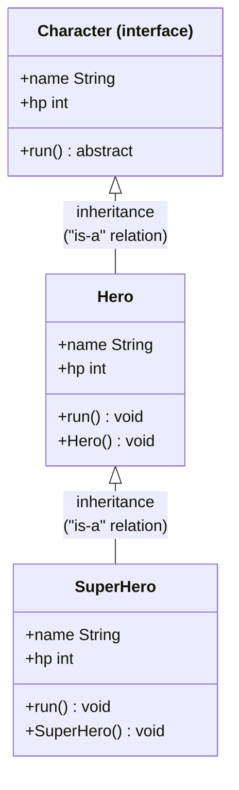

```mermaid
classDiagram

class Character["Character (interface)"]{
    +name String
    +hp int
    +run() abstract
}

class Hero{
    +name String
    +hp int
    +run() void
    +Hero() void
}

class SuperHero{
    +name String
    +hp int
    +run() void
    +SuperHero() void
}

Character <|-- Hero : inheritance</br>("is-a" relation)
Hero <|-- SuperHero : inheritance</br>("is-a" relation)

```
